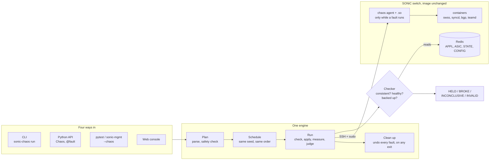
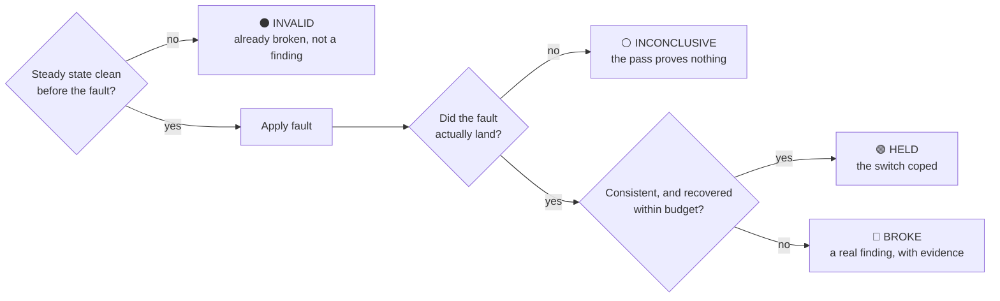
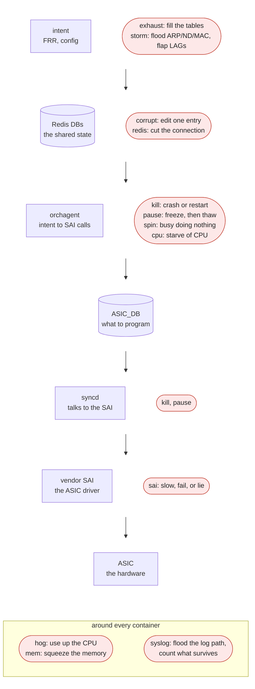
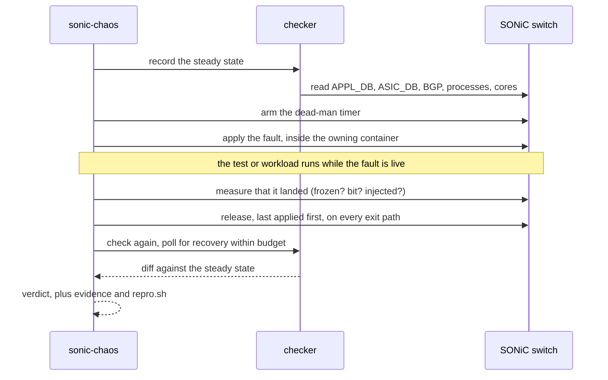
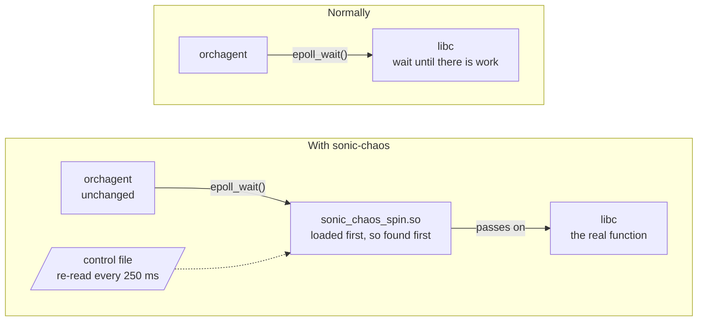
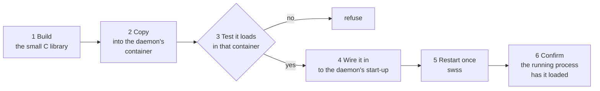
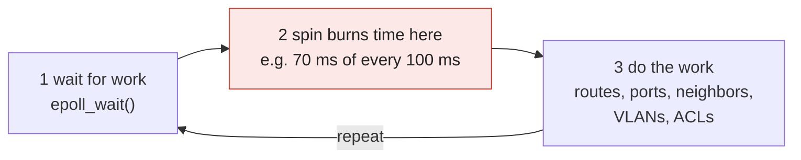
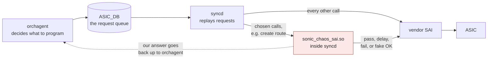
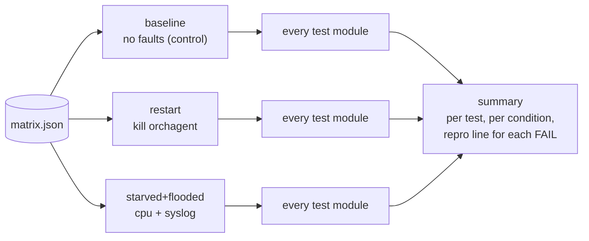

# sonic-chaos

**Break SONiC on purpose, and let the switch prove whether it held.**

sonic-mgmt tests prove a switch works on a quiet box. Production is not quiet: orchagent is busy
when a port flaps, syncd answers slowly, a daemon restarts mid-operation, a table fills up.
sonic-chaos puts those conditions under a running switch, or under your existing tests, with one
flag and no change to the SONiC image.

- **Inject** a realistic fault into a running switch: a crash, a freeze, an overload, or a failing
  ASIC call.
- **Observe** what breaks downstream while the fault is live.
- **Grade** the result: did the switch recover, and does it still agree with itself?

```sh
pip install -e .              # or: pip install sonic-chaos
sonic-chaos selftest          # the contract check; needs no switch
pytest tests/ --chaos-dut ssh://admin@10.0.0.5 --chaos kill=orchagent:how=restart
```



The design is in [docs/hld.md](docs/hld.md).

## What we check, every time

Before the first fault and after each one, sonic-chaos reads the switch's own state:

- **Consistent:** intent (APPL_DB) still matches what was programmed (ASIC_DB), for routes, LAGs,
  LAG members, neighbors, VLANs and VLAN members.
- **Healthy:** BGP sessions up, every critical process alive, no new core dumps, no service stuck
  at systemd's start limit.
- **Not backed up:** work is not piling up unprocessed in Redis.
- **Put back:** everything a fault changed is undone, on every exit path.

What was already wrong before the first fault is the baseline, not a finding.

## Four verdicts, not two

Most fault tools report pass or fail. But a CPU cap on an idle daemon, or a SAI error on an object
nothing creates, does nothing: the test passes and the pass is worthless. sonic-chaos measures
whether each fault actually landed.

| verdict | meaning | CLI exit |
|---|---|---|
| **HELD** | the fault engaged and the switch stayed consistent and recovered in budget | 0 |
| **BROKE** | an invariant diverged, or recovery missed its budget | 1 |
| **INCONCLUSIVE** | no fault engaged, so the pass proves nothing | 5 |
| **INVALID** | the switch was already down or diverged before any fault | 3 |



Every BROKE comes with its evidence: the oracle diff, the syslog slice, the fault as applied, and
a `repro.sh` that runs it again.

## Where each fault lands



| family | fault | example spec | what it does |
|---|---|---|---|
| process | `kill` | `kill=orchagent:how=restart:settle=60` | crash or restart a daemon or its container |
| | `pause` | `pause=orchagent:30` | freeze a daemon, then thaw it |
| | `corrupt` | `corrupt=APPL_DB:[LAG_MEMBER_TABLE:PortChannel101:Ethernet48]:delete=true` | edit or delete one Redis entry |
| | `redis` | `redis=client_kill:orchagent` | cut a daemon's Redis connections |
| | `syslog` | `syslog=3000:seconds=4:process=orchagent` | flood the log path and count what survives |
| resources | `cpu` | `cpu=orchagent:30` | cap a daemon's CPU, and report whether the cap bit |
| | `mem` | `mem=swss:90:ramp=5` | squeeze a container's memory limit |
| | `hog` | `hog=swss:cpu=40` | spend a container's CPU budget, not just cap it |
| inside the daemon | `spin` | `spin=orchagent:70:ttl=120` | keep orchagent's event loop busy doing nothing |
| | `sai` | `sai=vlan:create:status=SAI_STATUS_TABLE_FULL` | make chosen SAI calls slow, fail, or fake success |
| scale | `exhaust` | `exhaust=nhg:0:over_pct=110` | fill a hardware table past its limit, then scale back |
| | `storm` | `storm=netlink:rate=100:seconds=25` | ARP, ND or MAC-move storms from the PTF, or LAG flaps that burst netlink |

`sonic-chaos list` prints the faults, `sonic-chaos list invariants` the eleven checks, and
`sonic-chaos validate '<spec>'` checks a spec without touching a switch (a typo gets a suggestion).

## What a run does, start to finish

1. **Pick a fault**, e.g. "freeze orchagent for 10 seconds". The spec is validated and checked for
   safety before anything is applied.
2. **Apply it** over SSH, inside the container that owns the daemon.
3. **Watch the switch**: let the fault bite, and measure that it did.
4. **Undo it**, always: even if the test or the link dies. A dead-man timer on the switch removes
   the fault if the harness vanishes.
5. **Verdict**: HELD, or BROKE with the evidence attached.



Schedules are seeded: the same seed gives the same faults in the same order, so a failure replays.

## Inside the daemon: `.so` injection

`spin` and `sai` work from inside a running SONiC daemon. Linux lets you name a library that loads
before every other one (`LD_PRELOAD`); if it defines a function the program uses, the program calls
ours first, and ours passes the call on.



- **Nothing in SONiC changes.** Same image, same binaries. One daemon is told to load one extra
  library when it starts.
- **Off until switched on.** With no instructions the library passes every call through, so
  loading it is harmless.
- **One restart, once.** A library can only join a process when it starts, so the first `spin` or
  `sai` on a switch restarts swss once. Never again after that.

The first use does this automatically:



| daemon | where "wire it in" goes |
|---|---|
| orchagent (swss) | its start-up script, just before it launches |
| syncd | its entry in supervisord's config |
| other daemons | a small wrapper that loads ours, then starts them |

A copy of every file touched is kept and put back on uninstall. After that, switching a fault on
and off is a small control file written into the container ("burn 70%", "fail this SAI call"); the
library re-reads it every 250 ms, so a fault turns on or off in under a quarter of a second, with
no restart and nothing sent to the daemon. The C half and its tests are in
[src/sonic_chaos/shim](src/sonic_chaos/shim/README.md).

### `spin`: keep orchagent busy, but doing nothing

orchagent does all its work in one loop: wait for work, then do it. `spin` sits in the wait step
and burns CPU there (e.g. 70 ms of every 100 ms), so routes, ports, neighbors, VLANs and ACLs all
get late together.



| fault | CPU looks | work done |
|---|---|---|
| `cpu` (a CPU limit) | low | slower |
| `pause` (a freeze) | zero | none |
| `spin` | busy, up to 100% | little or none |

Only `spin` looks like a real live-lock: the CPU is maxed out, yet updates stop. A CPU limit or a
freeze can never reproduce that. On a SONiC virtual switch, requested shares held under load:
30% → 31.0%, 50% → 51.7%, 70% → 72.3%, 90% → 93.0%.

### `sai`: make the hardware answer badly, on demand

syncd reaches the ASIC through the vendor's SAI driver, and the library sits between them. When
syncd asks the driver for its function tables at start-up, the library answers first, takes the
real tables, and redirects only the entries chosen to itself; everything else goes straight to the
vendor driver. Each redirected call can be:



| action | spec | models |
|---|---|---|
| passed on | (nothing set) | normal behaviour |
| delayed | `sai=route_entry:create:delay=2000` | a slow ASIC |
| failed | `sai=vlan:create:status=SAI_STATUS_TABLE_FULL` | an error, e.g. table full |
| faked | `sai=route_entry:create:drop=true` | says OK, programs nothing |

Found this way on a SONiC virtual switch: a "not found" error on a VLAN-member remove is ignored by
orchagent, leaving a stale member in the hardware
(`sai=vlan_member:remove:status=SAI_STATUS_ITEM_NOT_FOUND:count=1`, caught by the `vlan_member`
invariant). "Table full" on a VLAN create was handled correctly: orchagent retried, then programmed
it once the fault was lifted.

## Four ways in, one engine

Whatever starts a run, the same engine plans the fault, applies it over SSH, and asks SONiC's own
databases whether the switch held.

**Command line,** one command per fault, from any machine that can reach the switch:

```sh
sonic-chaos run --dut ssh://admin@10.0.0.5 --chaos kill=orchagent:how=restart
sonic-chaos run --dut ssh://admin@10.0.0.5 --chaos-file orchagent-restart --chaos-seed 20260911
sonic-chaos run --dut ssh://admin@10.0.0.5 --chaos cpu=orchagent:30 --chaos-dry-run
sonic-chaos list [injectors|invariants|experiments|transports]
sonic-chaos validate 'sai=route_entry:create:delay=2000'
```

**Python API,** to wrap any workload:

```python
from sonic_chaos import Chaos, SshDut

chaos = Chaos(SshDut("10.0.0.5", user="admin"))   # records the steady state first
with chaos.spin("orchagent:70", ttl=600):          # released on exit, even on ^C
    push_my_config()
chaos.assert_recovers(within=90)                   # raises ChaosFinding if the box diverged
```

or as a decorator:

```python
from sonic_chaos import fault

@fault("kill=orchagent:how=restart")
@fault("sai=route_entry:create:delay=2000")        # stacks; each fault is applied once
def test_route_scale(duthost):
    ...
```

Under pytest `@fault` is the `chaos` marker and the plugin runs the lifecycle. Called outside
pytest it runs baseline, apply, call, release and check itself.

**pytest and sonic-mgmt,** a plugin for existing tests:

```sh
pytest tests/ --chaos-dut ssh://admin@10.0.0.5 --chaos kill=orchagent --chaos-repeat 5
pytest tests/ --chaos-dut ssh://admin@10.0.0.5 --chaos-file orchagent-restart
```

Installing the package registers the plugin (`pytest11`). With no `--chaos*` option and no marker
it requests no fixture and runs no command. Tests take the switch from the `chaos_duts` fixture,
and the `chaos` fixture offers `chaos.fault(...)`, `chaos.kill/pause/spin/sai(...)` and
`chaos.assert_recovers(within=...)` in the middle of a test.

Inside sonic-mgmt it is one module and one `pytest_plugins` line, and the testbed's own `duthosts`,
`sanity_check` and `loganalyzer` are used; see [integration/sonic-mgmt](integration/sonic-mgmt/README.md).

**Web console,** click, run, and watch live:

```sh
sonic-chaos console --dut ssh://admin@10.0.0.5     # prints http://localhost:8811/?token=...
sonic-chaos console --host 0.0.0.0 --dut ...       # reachable from the lab
```

A run is a structured request that the server turns into a fixed `sonic-chaos run` command; the
page cannot run anything else on the machine. Every console has a token (generated unless
`--token` gives one; `--no-token` only on loopback). POSTs must be `application/json`, an `Origin`
must match the `Host`, and on loopback the `Host` must be one the console answers to, so another
web page open in the same browser cannot start a run.

## Switch addresses

`--dut`, `--chaos-dut` and the console take the same URLs:

| URL | reaches the switch by |
|---|---|
| `ssh://user@host[:port]` | OpenSSH, key-based, non-interactive |
| `local://` | this machine is the switch |
| `cmd:<prefix>` | any command prefix, e.g. `cmd:sshpass -p X ssh admin@10.0.0.5` |
| `<scheme>://...` | a scheme a site package registers (`sonic_chaos.transports`) |

Commands run under `sudo -n` when the login is not root and sudo works; the transport probes that
once. Every file copy is size-checked on arrival.

## Conditions: every test under every fault list

```sh
pytest tests/ --chaos-dut ssh://admin@dut204 --chaos-conditions examples/conditions-example.json
pytest tests/ ... --chaos-conditions matrix.json --chaos-condition restart    # just one of them
pytest tests/ ... --chaos-conditions matrix.json --chaos-repeat 5             # 5 runs per condition
```

A condition is a named list of faults applied together. Every collected test runs once per
condition, and the parameter is module scoped: a module runs to completion under one condition
before the next is applied, so a condition with a kill in it fires once per module, not once
per test.



```json
{
  "conditions": [
    {"name": "baseline", "faults": []},
    {"name": "restart",  "faults": ["kill=orchagent:how=restart:settle=60"]},
    {"name": "starved+flooded",
     "faults": ["cpu=orchagent:30", "syslog=1000:seconds=30:process=orchagent"],
     "note": "does the evidence for the first survive the second?"},
    [{"sai": {"object_type": "vlan_member", "op": "remove",
              "status": "SAI_STATUS_ITEM_NOT_FOUND", "count": 1}}]
  ]
}
```

A fault is a `--chaos` spec string or the experiment-file dict shape. `name` defaults to the
injector names joined with `+`; an empty `faults` list is a control run, counted and checked
like the others, and it takes the oracle baseline too so a box handed over already divergent is
subtracted rather than blamed on it. The whole file is validated at configure time, so a typo in
the fourth condition fails before the first test. Test ids carry the condition
(`test_po_update[restart]`, or `[restart-run3]` with `--chaos-repeat`), every result carries a
`chaos_condition` junit property, and the summary counts per test per condition:

```
conditions: matrix.json
  baseline             no fault (control)
  frozen               pause(container=swss,how=signal,process=orchagent,seconds=240)
  FAIL test_static_route_reaches_asic[frozen]      1 run / 1 FAIL
       repro: out/chaos/.../repro.sh      -> --chaos-conditions matrix.json --chaos-condition frozen
  ok   test_static_route_reaches_asic[baseline]    1 run / all pass
```

Session-wide `--chaos` faults stack underneath and release after the condition's, LIFO.
`tests/unit/test_conditions.py` drives `pause` and `kill` through a matrix on a recording DUT.
The same matrix against a lab switch (HWSKU-A-F, 202511.vendor.200878, 64 BGP peers) on
2026-09-29, two tests under three conditions, oracle group `health`:

| | baseline | `pause=orchagent:240` | `cpu=orchagent:30` |
|---|---|---|---|
| BGP peers all Established | pass | pass | pass |
| static route in ASIC_DB within 20 s | pass | **FAIL** (not there after 24 s) | pass |
| measured | | `frozen: True` | `bit: False, achieved 0.07, peak 0.36` |

Two things that run taught. A 45 s freeze was not long enough: the health check after the first
test took most of it and the route test ran against a thawed orchagent, which the measured
property said (`frozen: False`). And the cap never bit, because orchagent on an idle box wants
0.07% of a core; `hog` is the condition that would.

## Experiments

Experiments are YAML files of weighted faults that a seed turns into a schedule
(`sonic-chaos schema` prints the JSON Schema). Two ship with the package and run by name:
`orchagent-restart` and `sai-item-not-found`.

## Extending it

```python
from sonic_chaos import Injector, register_injector, invariant

@register_injector("netem", lane="spine", positional=("port", "loss"))
class Netem(Injector):
    def apply(self, duthost, **_):
        duthost.shell("tc qdisc add dev {port} root netem loss {loss}%".format(**self.params))
    def release(self, duthost):
        duthost.shell("tc qdisc del dev {port} root".format(**self.params), module_ignore_errors=True)
```

A separate package declares the same through entry points, and `--chaos netem=Ethernet0:5` then
works everywhere, the console included:

| entry-point group | provides |
|---|---|
| `sonic_chaos.injectors` | Injector subclasses, or modules that register them |
| `sonic_chaos.invariants` | modules whose `@invariant` functions register on import |
| `sonic_chaos.transports` | URL schemes: `name = "pkg.mod:factory"`, `factory(parsed_url, url) -> Dut` |
| `sonic_chaos.profiles` | a platform's containers and daemons, laid over `profiles/default.yml` |
| `sonic_chaos.console_duts` | the switches a console offers: `[{host, url, hwsku, topo}]` |

## Layout

```
.
├── pyproject.toml                   sonic-chaos; scripts: sonic-chaos; pytest11 entry point
├── src/sonic_chaos/
│   ├── __init__.py                  public API (lazy: importing it pulls in neither pytest nor injectors)
│   ├── api.py                       Chaos, @fault, register_injector, invariant
│   ├── transport.py                 CommandDut, SshDut, LocalDut, open_dut
│   ├── injector.py, injectors/      the spec grammar, the registry, the twelve injectors
│   ├── oracle.py, invariants.py     snapshots, diffs, the eleven invariants
│   ├── experiment.py                experiment files, seeded schedules, the JSON Schema
│   ├── engine/runner.py             the run loop behind `sonic-chaos run` and the console
│   ├── pytest_plugin.py             the pytest plugin, generic or inside sonic-mgmt
│   ├── console/                     the web console
│   ├── agent/chaos_agent.py         pushed to the switch: cgroups, dead-man timers (stdlib only)
│   ├── shim/                        the sai and spin interposers (C), with their own tests
│   ├── profiles/default.yml         the community SONiC container and daemon set
│   ├── experiments/                 experiments that ship with the package
│   ├── tools/                       harness self-checks against a real switch (sonic-chaos tool)
│   └── testing/                     RecordingDut, for testing code that drives a switch
├── tests/                           unit, contract and golden-transcript suites
├── integration/sonic-mgmt/          the sonic-mgmt adapter and patch
├── examples/                        worked sonic-mgmt tests
└── docs/hld.md                      the design
```

## Testing

```sh
pip install pytest PyYAML jsonschema
python -m pytest -q                 # ~280 tests, ~1 min; the plugin suites spawn pytest subprocesses
flake8 .                            # 120 columns, like sonic-mgmt
sonic-chaos shim build              # the C interposers: build, ABI and glibc check, their own tests
```

- **Golden transcripts** (`tests/golden/`) freeze the exact commands every injector sends. A change
  that means to change them shows up as a reviewable diff:
  `python -m pytest tests/golden --update-golden && git diff tests/golden/transcripts`.
- **`test_hygiene`** keeps lab specifics (testbed names, ticket numbers, lab CLIs, private paths)
  out of the shipped package; they belong in a site package.

Tested on Python 3.12 and on 3.11 (`debian:bookworm`). The CI workflow is
`.github/workflows/ci.yml`.

## Team

Built at the SONiC hackathon 2026 by Ravindra, Karthik, Indrashis and Vaishnav.
